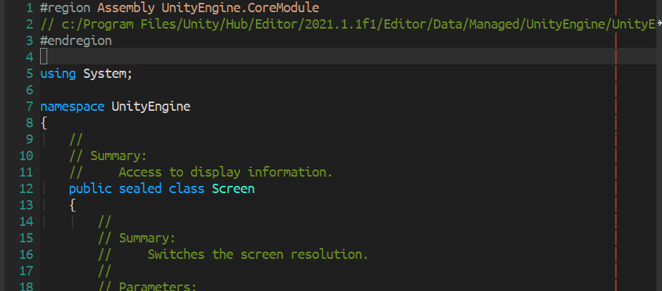

[](https://www.gnu.org/licenses/gpl-3.0)
[](https://celpa.conao3.com/#/meta-view)

# meta-view
> View metadata from .NET assemblies


<p align="center">
  
</p>

View assembly metadata, and it's documentation from a C# project, generated
by Visual Studio IDE (not VSCode).

*P.S. This package mimics the [MetadataSource](https://github.com/dotnet/roslyn/tree/main/src/Features/Core/Portable/MetadataAsSource)
feature from Visual Studio IDE*

## :floppy_disk: Usage

### :mag: 1. Open a C# file

Make sure the `.cs` file is a valid source file under a C# project.

### :mag: 2. View assembly metadata!

Navigate to a symbol you want to search, then call `M-x meta-view-at-point`.

## :hammer: Configurations

#### `meta-view-active-modes`

Major modes that allow to view metadata source, default is `csharp-mode`.

#### `meta-view-after-insert-hook`

Hooks run after buffer is inserted to display view, default is `nil`.

For example, display line numbers for metadata buffer. (on left)

```el
(add-hook 'meta-view-after-insert-hook
          (lambda ()
            (display-line-numbers-mode 1)))
```

| Display Line Numbers         | Advance                       |
|------------------------------|-------------------------------|
|  |  |

You can fold all comments by your favorite folding package. (on right)

#### `meta-view-display-function`

Function call to display reference data, default to `#'switch-to-buffer`.

## Contribute

[](http://makeapullrequest.com)
[](https://github.com/bbatsov/emacs-lisp-style-guide)

If you would like to contribute to this project, you may either
clone and make pull requests to this repository. Or you can
clone the project and establish your own branch of this tool.
Any methods are welcome!
